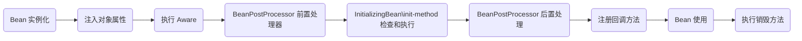

## Bean作用域

| 名称           | 作用域                                                       |
| -------------- | ------------------------------------------------------------ |
| singleton      | 单例对象，默认值的作用域                                     |
| prototype      | 每次获取都会创建一个新的 Bean 实例                           |
| request        | 每一次 HTTP 请求都会产生一个新的 Bean，该 Bean 仅当前 HTTP  request 内有效 |
| session        | 在一次 HTTP session 中，容器将返回同一个实例                 |
| global-session | 将对象存入到 web 项目集群的 session 域中，若不存在集群，则 global session 相当于 session |

> 默认作用域是 Sigleton，多线程访问同一个 Bean 时会存在线程不安全问题
>
> **保障线程安全方法**：
>
> * 在 Bean对象中尽量避免定义可变的成员变量（不太实际）
> * 在类中定义一个 ThreadLocal 成员变量，将需要的可变成员变量保存在 ThreadLocal 中

## 启动初始化

**@PostConstruct**：

> 在 Bean 创建期间由 Spring 调用的初始化方法
>
> * 使用：将 @PostConstruct 注解添加到方法上就行

**InitializingBean**：

> 实现 InitializingBean 接口，让 Spring 调用某一个初始化方法

## Controller 和 Service 是否线程安全的

默认情况下，Scope 值是单例（Singleton）的，是线程不安全的。

尽量不要在 @Controller / @Service 等容器中定义静态变量，不论是单例还是多例都是线程不安全的。

## BeanFactoryPostProcessor 和 BeanPostProcessor

**BeanFactoryPostProcessor：**

* 在 Bean 工程实例化 Bean 之前对 Bean 的定义进行修改
* ta可以读取和修改 Bean的定义元数据，例如修改 Bean 的属性值、添加额外的配置信息等

**BeanPostProcessor：**

* 在 Bean 实例化后对 Bean 进行和增强或修改
* ta可以在 Bean 的初始化过程中对 Bean 进行后处理，例如对 Bean 进行代理、添加额外的功能等

## Bean 的生命周期

Spring 的生命周期大致分为：创建 -> 属性填充 -> 初始化 Bean -> 使用 -> 销毁 几个核心阶段

* 创建阶段：主要是创建对象，对象的创建权交由 Spring 管理
* 属性填充阶段：主要是进行依赖的注入，将当前对象以来的 Bean 对象，从 Spring 容器中拿出，然后填充到对应的属性中
* 初始化 Bean 阶段：包括回调各种 Aware 接口、回调各种初始化方法、生成 AOP 代理对象也在该阶段进行，该阶段主要是完成初始化回调
* 使用 Bean 阶段：主要是 Bean 创建完成，在程序运行期间，提供服务的阶段
* 销毁 Bean 阶段：主要是容器关闭或停止服务，对 Bean 进行销毁处理



## 循环依赖

循环依赖指：**一个实例或多个实例存在相互依赖的关系**（类之间循环嵌套引用）

参考如下代码：

```java
public class AService {
    private BService bService;
}
public class BService {
    private AService aService;
}
```

### **Bean 的创建步骤**：

> 在创建 Bean 之前，Spring 会通过扫描获取 BeanDefinition，
>
> BeanDefinition 就绪后会读取 BeanDefinition 中所对应的 class 来加载类。
>
> **实例化阶段**：根据构造函数来完成实例化（**没有属性注入以及初始化的对象**（原始对象））
>
> **属性注入阶段**：对 Bean 的属性进行依赖注入。
>
> 若 Bean 的某个方法有 AOP  操作，则需要根据原始对象生成 **代理对象**。
>
> * AOP 代理是 BeanPostProcessor 实现的，而 BeanPostProcessor 是发生在属性注入阶段后的。
>
> 最后把代理对象放入单例池（一级缓存 singletonObjects）中。

### **为什么 Spring Bean 会产生循环依赖问题？**

> **以参考代码分析**： 
>
> 当 AService 创建时，会对 AService 实例化生成一个原始对象，
>
> 然后在进行属性注入时发现了需要 BService 对应的 Bean，
>
> 此时就会去 BService 进行创建，在 BService 实例化后生成一个原始对象后进行属性注入，此时会发现也需要 AService 对应的 Bean。

### **三大循环依赖问题场景：**

> 1、单例作用下的 Setter 方法注入/Field 属性注入出现的循环依赖
>
> * 在 Spring 中 是不会 产生循环依赖问题的，这主要是靠 **三级缓存** 机制解决
>
> 2、单例作用域下的构造器注入出现的循环依赖
>
> * 因 **构造注入** 发生在 **实例化阶段**，而 Spring 解决循环依赖问题依靠的 **三级缓存** 是在 **属性注入阶段**，也就是说调用构造函数时还未能放入三级缓存中，所以无法解决 **构造器注入** 的循环依赖问题
>
> 3、原型作用域下的属性注入出现的循环依赖问题
>
> * 因 Spring 不会缓存 **原型** 作用域的 Bean，所以 Spring 无法解决 **原型** 作用域的 Bean

### **三级缓存：**

```java
/** Cache of singleton objects: bean name to bean instance. */
private final Map<String, Object> singletonObjects = new ConcurrentHashMap<>(256);

/** Cache of singleton factories: bean name to ObjectFactory. */
private final Map<String, ObjectFactory> singletonFactories = new ConcurrentHashMap<>(16);

/** Cache of early singleton objects: bean name to bean instance. */
private final Map<String, Object> earlySingletonObjects = new ConcurrentHashMap<>(16);
```

* 一级缓存（singletonObjects）：缓存的是 **已经实例化、属性注入、初始化后**的 Bean对象
* 二级缓存（earlySingletonObjects）：缓存的是**实例化后，但未属性注入、初始化**的 Bean对象（用于提前暴露 Bean）
* 三级缓存（singletonFactories）：缓存的是一个 **ObjectFactory**，主要作用是生成原始对象进行 AOP 操作后的**代理对象**（这一级缓存主要用于解决 AOP 问题）

### **为什么缓存可以解决循环依赖问题？**

> 在创建 **AService** 时，实例化后将 **原始对象** 存放到缓存中（提早暴露），
>
> 然后依赖注入时发现需要 BService，便会去创建 **BService**，实例化后同样 **原始对象** 存放到缓存中，然后依赖注入时发现需要 **AService** 便会从缓存中取出并注入，这样 **BService** 就完成了创建，随后 **AService** 也能完成属性注入，最后也完成创建。


### **为什么还需要第三级缓存？**

> **第三级缓存**（singletonFactories）是为了 Spring 的 AOP 做处理的。
>
> 1、如果 **AService** 中方法没有使用 AOP 操作，会发现 **BService** 注入的原始对象与最后 **AService* 完成创建的最终对象是 **同一个对象**。
>
> 2、如果 **AService** 方法中有 AOP 操作时，当 **AService** 的原始对象赋值（注入）给 **BService**，**AService**会进行 AOP 操作产生一个 **代理对象**，这个代理对象最终会被放入单例池（一级缓存）中，也就是说此时 **BService**中注入的对象是原始对象，而 **AService** 最终创建完成后是代理对象，这样就会**导致 Bservice 依赖的 AService 和 最终的 AService 不是同一个对象**，
> 出现这个问题的原因：AOP  是通过 BeanPostProcess 实现的，而 BeanPostProcessor 是在**属性注入阶段后** 才执行的，所以会导致 **注入的对象有可能和最终的对象不一致**


### **Spring 是如何通过第三级缓存来避免 AOP 问题的？**

三级缓存通过利用 **ObjectFactory** 和 **getEarlyBeanReference()** 做到了提前执行 AOP 操作从而生成代理对象。

在上移到二级缓存时，可以做到如果 Bean 中有 AOP 操作，那么提前暴露的对象会是 AOP 操作后返回的代理对象；如果没有 AOP 操作，那么提前暴露的对象会是原始对象。

* 只有等完成了属性注入、初始化后的 Bean 才会上移到一级缓存（单例池）中

这样就能做到出现循环依赖问题时，注入依赖的对象和最终生成的对象是同一个对象。

* 相当于 AOP 提前在属性注入前完成，这样就不会导致后面生成的代理对象与属性注入时的对象不一致

